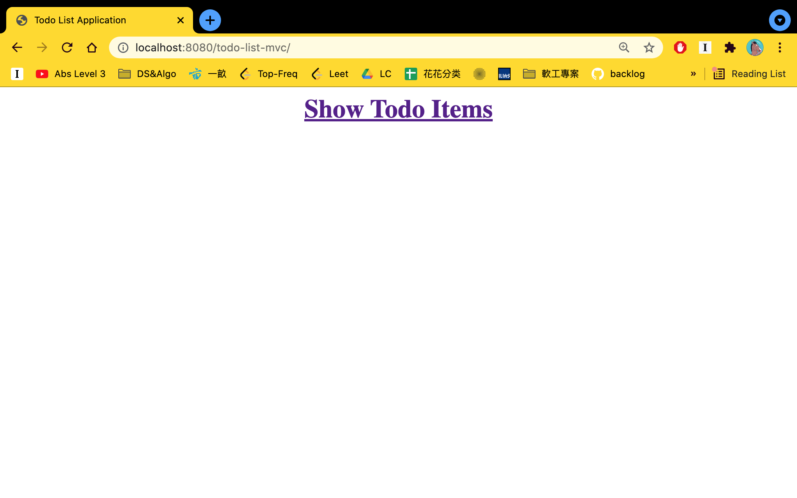
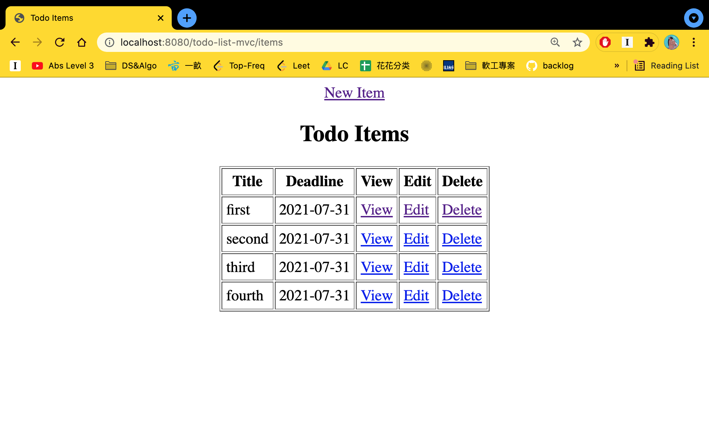
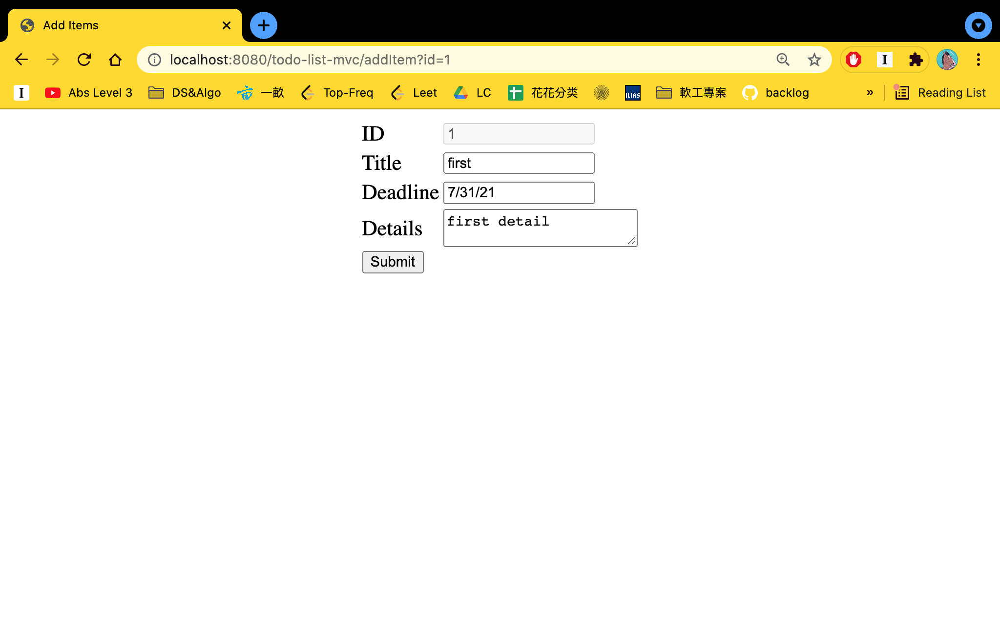
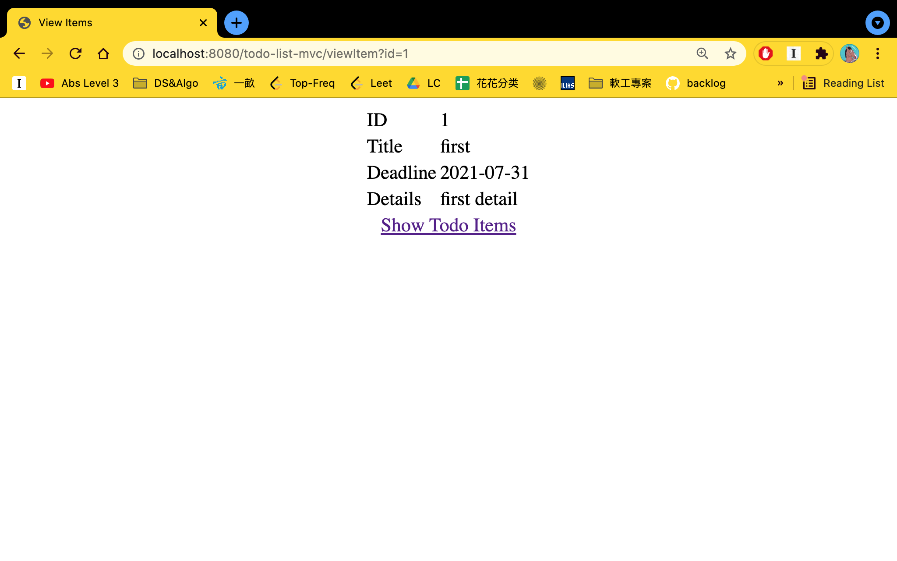

This is a spring mvc project from Udemy course: Java Spring Tutorial Masterclass - Learn Spring Framework 5

The project is used to demonstrate my ability in spring MVC
To build the app: "clean install"
To run the app: use maven plug-in "cargo:run"
Homepage access: http://localhost:8080/todo-list-mvc/
Setup to be noticed with POM file and can be used as template:
- embedded Tomcat server with cargo
- jstl tags
- lombak annotation

Spring
- model
- service annotation

